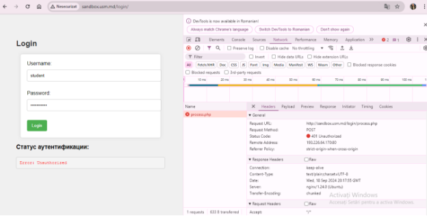
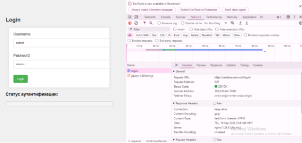

**Lucrare de laborator nr. 1. Bazele HTTP**

**Scop:**

Scopul acestei lucrări de laborator este studierea principiilor de bază ale protocolului HTTP.

**Condiții**

**Sarcina nr. 1. Analiza cererilor HTTP**

1. Accesarea site-ul <http://sandbox.usm.md/login>.

Deschiderea filei Network în instrumentele pentru dezvoltatori ale browserului.

1. Introducerea datelor incorecte pentru autentificare (username: student, password: studentpass).

1. **Date incorecte pentru autentificare:**

- **Ce metodă HTTP a fost utilizată pentru a trimite cererea?**

Metoda HTTP utilizată pentru a trimite cererea de autentificare este POST., folosită pentru a trimite date către server, mai ales când se transmit informații sensibile, cum ar fi datele de autentificare (username și password).

- **Ce anteturi au fost trimise în cerere?**

· Connection: keep-alive · 

Content-Type: text/plain; charset=UTF-8 · 

Date: Wed, 18 Sep 2024 20:17:55 GMT · 

Server: nginx/1.24.0 (Ubuntu) · 

Transfer-Encoding: chunked

- **Ce parametri au fost trimiși în cerere?**

username: student password: studentpass

- **Ce cod de stare a fost returnat de server?**

A fost returnat codul de stare 401 Unauthorized \*\*

1. **Date corecte pentru autentificare:**

- **Ce metodă HTTP a fost utilizată pentru a trimite cererea?**

Metoda HTTP utilizată pentru a trimite cererea de autentificare este POST. 

- **Ce anteturi au fost trimise în cerere?**

Connection: keep-alive

` `Content-Type: text/plain; charset=UTF-8 

Date: Thu, 19 Sep 2024 21:41:46 GMT 

Server: nginx/1.24.0 (Ubuntu) Transfer-Encoding: chunked

- **Ce parametri au fost trimiși în cerere?**

username: admin password: password

- **Ce cod de stare a fost returnat de server?**

A fost returnat codul de stare 200 OK \*\*

**Sarcina nr. 2. Crearea cererilor HTTP**

1. **Cererea GET** trimite o solicitare către server la adresa http://sandbox.com

GET / HTTP/1.1

Host: sandbox.com

User-Agent: Cotorobai Loredana

1. **Cererea POST** trimite date către server.

POST /cars HTTP/1.1

Host: sandbox.com

Content-Type: application/x-www-form-urlencoded

make=Toyota&model=Corolla&year=2020

1. **Cererea PUT** este utilizată pentru a actualiza datele pe server.

PUT /cars/1 HTTP/1.1

Host: sandbox.com

User-Agent: Cotorobai Loredana

Content-Type: application/json

{

`    `"make": "Toyota",

`    `"model": "Corolla",

`    `"year": 2021

}

**Cerere POST**

HTTP/1.1 201 Created

Content-Type: application/json

{

"id": 1,

"make": "Toyota",

"model": "Corolla",

"year": 2020

}

**Cerere PUT**

HTTP/1.1 200 OK

Content-Type: application/json

{

"id": 1,

"make": "Toyota",

"model": "Corolla",

"year": 2021

}

**Situații în care serverul poate returna coduri de stare HTTP**

- 200 OK: Cererea a fost procesată cu succes..
- 201 Created: Cererea POST a fost procesată cu succes și a fost creată o nouă resursă.
- 400 Bad Request: Cererea este invalidă, de exemplu, parametrii lipsă sau format incorect.
- 401 Unauthorized: Autentificarea este necesară și a eșuat sau nu a fost furnizată.
- 403 Forbidden: Serverul a înțeles cererea, dar refuză să o autorizeze.
- 404 Not Found: Resursa solicitată nu a fost găsită pe server.
- 500 InternalServer Error: Serverul a întâmpinat o eroare neașteptată care l-a împiedicat să proceseze cererea.

1. **Cererea de tip DELETE** ste utilizată atunci când dorim să eliminăm o resursă de pe server

DELETE /cars/1 HTTP/1.1

Host: sandbox.com

User-Agent: Cotorobai Loredana

